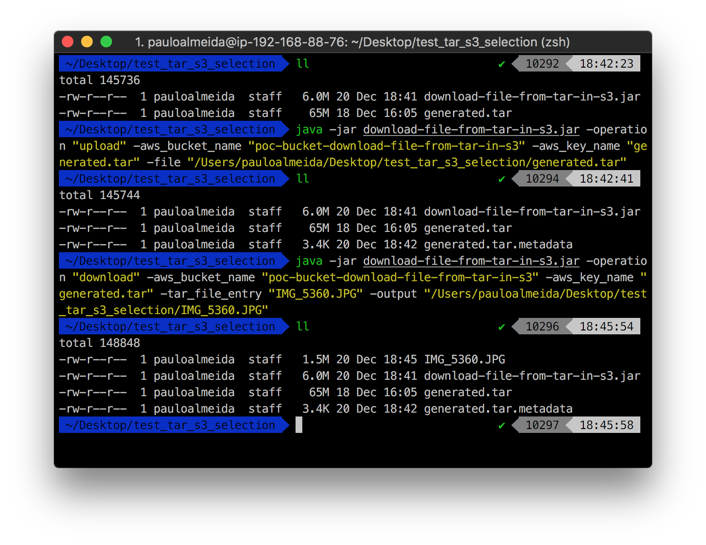

# download-file-from-tar-in-s3

## Introduction / Motivation

One of the most painful points of backing up your EBS/EFS files to S3 is that you will lose the POSIX permissions. In some cases this totally acceptable as you can rebuild the permissions using ```chmod``` and/or ```chown```. However, there are scenarios in which it would be unrealistic given the inability to rebuild the files permissions due to a variety of reasons that you should already know if you got to this page. 

In the case of EFS, it gets a bit trickier as you often find yourself in one of the two scenarios described below:

1. You may use EFS-to-EFS backup solution similar to [this](http://docs.aws.amazon.com/solutions/latest/efs-to-efs-backup/welcome.html) one developed by AWS Solutions Builder team. It's a fairly good solution as it keeps the POSIX permissions across multiple EFS, perform incremental backups and handle backup retention policy. However, it becomes a bit difficult to cope with depending on your VPC/Network configurations (Subnet w/wo auto assign public IP, Proxy configurations, DHCP OptionSet, specific security groups, frequency <-> throughput). It is worth mentioning that the price per GB data stored on EFS is the biggest on AWS which automatically implies that cost-sensitive architectures will rule out this approach.

2. You may write a EFS-to-S3 kind of solution using a cron job to ```aws s3 sync``` the files to S3. However, if you tackle this problem that way, you will lose the file permissions, symbolic links, the amount of time to sync them to S3 can be huge depending on the size of the files vs instance type and most importantly, your S3 API costs will skyrocket as you are charged as you go. On the other hand, you can granularly manage S3 data lifecycle (Data-tiering), the price per GB is likely the lowest in the world.

As you can see, it's one of the situations in which you need to choose the lesser evil solution. Only a few people realise it but although the second answer seems to be a good trade-off, managing data lifecycle from S3 to Glacier using small files may not be the wisest idea you ever had (for obvious reasons) and depending on the size of your EFS file system you may be throttled and this goes into a whole new level of complexity.

As a result, some architect/developers opt for compressing multiple files into a tar, which keeps the POSIX permissions and reduce the number of S3 API calls and allow the Glacier archive usage cost-effective (sounds good, hey?). However,it would imply that developers would lose the ability to retrieve a single file (until now :]).  This experiemental utility tool generates a metadata file which can later be used to download individual files to enable you to have the best of both worlds.

It's essential to understand that this is at an experimental stage and not all features of the tar file format are implemented at this time. If you want to see a feature developed/released sooner, please feel free submit your PR ;)





## Build

```Shell
mvn clean compile package
```

## Usage

```
usage: java -jar download-file-from-tar-in-s3.jar <options>
 -help              print this message
 -operation <arg>   Operation - It needs to be either upload or download


usage: java -jar download-file-from-tar-in-s3.jar -operation upload
            <options>
 -aws_bucket_name <arg>   S3 bucket name
 -aws_key_name <arg>      S3 key name
 -file <arg>              local file


usage: java -jar download-file-from-tar-in-s3.jar -operation download
            <options>
 -aws_bucket_name <arg>   S3 bucket name
 -aws_key_name <arg>      S3 key name
 -output <arg>            destination file
 -tar_file_entry <arg>    entry in the tar file
```
